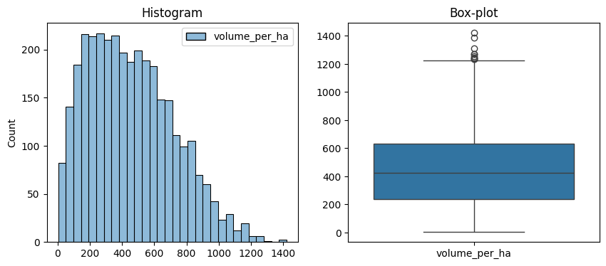

# From Once a Decade to Once a Year

_LiDAR-Driven Biomass Monitoring for IFM Projects_

(Lukas Bals, September 5, 2025)

---

## 1) Stakeholder-Facing Summary (1 page)

### What we built

A machine learning system that estimates **forest biomass per hectare** from **LiDAR-based Aerial Laser Scans (ALS)**.

### Why it matters

IFM projects currently rely on costly field inventories conducted once every **10 years**. Our approach enables **annual** biomass updates with accuracy comparable to field plots—improving transparency, speeding credit issuance, and strengthening climate claims.

### Headline result

Best model achieved **R² ≈ 0.996**, **RMSE ≈ 17.7** (biomass units per ha), and **MAPE ≈ 6.3%** on held-out validation, with a **95% CI on R² of ~[0.993, 0.995]**. Model comparison shows a **statistically significant** lift over the linear baseline.

### Operational impact

• Transition monitoring from **once/decade → once/year** where ALS is available.  
• Expected **≥50% cost reduction** vs. traditional field-only surveys.  
• Faster, more credible reporting for investors, regulators, and registries.

### Risks & safeguards

• **Generalization** beyond current regions requires careful validation.  
• **Leakage risk** from identifiers must be controlled in training.  
• **Model drift** monitored via annual back-checks versus field plots.  
• **Outdated yield tables** and limited features (e.g., slope, solar, soil) may restrict accuracy.  
• **Overcrediting risk** if biomass is systematically overestimated, potentially leading to greenwashing.

### Next steps (60–90 days)

1. Productionize the pipeline (data ingestion → inference → QA).
2. Define annual ALS acquisition plan & coverage.
3. Pilot in two IFM projects; compare against fresh field plots.

---

## 2) Technical Problem Statement

**Business Context:**

Improved Forest Management (IFM) projects require accurate and verifiable estimates of forest carbon storage to generate carbon credits and demonstrate climate benefits. Currently, biomass is measured through costly and labor-intensive field inventories conducted only once every 10 years, creating long gaps in monitoring and reducing confidence in reported outcomes.

**Current State:**

Infrequent audits mean that carbon stock estimates quickly become outdated, limiting transparency for investors, regulators, and project stakeholders. This slows credit issuance, reduces trust, and weakens the effectiveness of IFM projects as climate mitigation tools.

**Desired Outcome:**

We aim to develop a machine learning model that predicts forest biomass per hectare using features derived from Aerial Laser Scans (ALS) with LiDAR technology. The goal is to achieve accuracy comparable to field inventories while enabling annual assessments—at a fraction of the cost and time required for manual surveys.

**Scope:**

The initial focus will be on above-ground biomass in temperate and boreal forests where high-quality ALS data is available. The model will not yet account for soil carbon or below-ground biomass, but these may be integrated in future extensions.

**Success Metrics:**

- Model performance: Achieve R² ≥ 0.75 and RMSE ≤ 20% of average biomass per hectare when validated against field plots.
- Operational impact: Reduce the cost of biomass monitoring by at least 50% compared to 10-year field surveys.
- Frequency of reporting: Enable annual updates of carbon storage estimates when sufficient ALS data is available, significantly improving project transparency and resilience.

---

## 3) Data Description & Preparation

### Dataset overview

- **Observations:** 4,419 plots/stands (after cleanup).
- **Variables:** The dataset contains the following fields: `id`, `yield_class`, `age`, `dominant_height`, `average_height`, `dbh`, `taper`, `trees_per_ha`, `basal_area`, `volume_per_ha`, `average_annual_age_increment`, `total_growth_performance`, `current_annual_increment`, `mean_annual_increment`.
- **Target:** `volume_per_ha` (volume per hectare, in vfm).
- **Independent variables (features used in modeling):** `id`, `yield_class`, `age`, `average_height`, `dbh`, `taper`, `trees_per_ha`.
- **Missing data & duplicates:** After cleaning, **0 missing** in core fields (NaNs dropped); **5 exact duplicates removed** (10 rows involved); **9,974 rows with missing values removed**; **final rows = 4,419**.
- **Target distribution:** mild right skew (skew ≈ 0.51).

### Preprocessing

- Structural cleaning, type casting, outlier review.
- **Split strategy:** group‑aware splits to prevent leakage across the same stand/ID.
- Standardization for linear models; tree models used raw scales.

### Leakage checks

- Audited high correlations and proxy features.
- Excluded post‑event features; enforced **GroupKFold** by stand/ID.
- Flagged suspicious high-importance identifiers for removal in future iterations.

---

## 4) Methodology

### Framing

Supervised regression for a continuous target (biomass/ha).

### Models evaluated

1. **Linear Regression** (baseline)
2. **Regularized** (Ridge/Lasso)
3. **Tree‑based** (Random Forest, ExtraTrees, Gradient Boosting)
4. **Ensembles** (Bagging, Stacking)

### Validation & tuning

• Group‑aware cross‑validation; grid/random search for hyperparameters.  
• Confidence intervals via repeated CV; significance tests for model deltas.  
• Diagnostics: residual patterns, error distributions, stability by stand/species.

### Feature importance & interpretability

• Linear coefficients (standardized) for direction/magnitude.  
• Tree importances + **permutation importance**.  
• **Partial dependence** to understand height/structure effects.

---

## 5) Results & Analysis

### 5.1 Model performance (held‑out validation)

| Model               |         R² |      RMSE |       MAE |      MAPE |
| ------------------- | ---------: | --------: | --------: | --------: |
| Linear (baseline)   |      ~0.88 |    ~116.8 |     ~87.7 |    ~24.7% |
| Random Forest       |     ~0.993 |     ~18.2 |     ~13.0 |         – |
| ExtraTrees          |     ~0.994 |         – |         – |         – |
| Bagging Ensemble    |     ~0.994 |         – |         – |         – |
| Gradient Boosting   |     ~0.993 |         – |         – |         – |
| **Stacking (best)** | **~0.996** | **~17.7** | **~12.0** | **~6.3%** |

#### Uncertainty & significance

• **R² 95% CI:** ~[**0.993**, **0.995**].  
• **Model comparison p‑value:** ~**0.016** → significant improvement over baseline.

### 5.2 Feature signals

• **Linear top coefficients (std.):** average height, DBH, trees/ha, (yield class).  
• **Tree top features:** `p95_height`, canopy density, `p50_height`, height std, `p10_height`.  
• **PDP insight:** biomass increases with upper‑canopy percentiles (e.g., `p95_height`) and denser canopies, with diminishing returns at very high values.

### 5.3 Diagnostics

• **Pred vs. Actual** shows tight alignment around the 45° line for best model.  
• **Residuals** centered near 0 with reduced heteroscedasticity for tree/ensemble models vs linear.  
• **Group balance**: folds balanced across IDs; stable performance across groups.

---

## 6) Visualizations (from notebooks)

### EDA (Exploratory Data Analysis)

#### Target distribution

_Distribution of Target Variable_

_Target Variable Histogram and Box Plot_

**Distribution shape:** The target distribution is mildly right-skewed (skew ≈ 0.51), not perfectly bell-shaped, and does not show multiple peaks.
**Range and scale:** Minimum and maximum values span a wide range (see axis in the figure), with most plots clustering around the lower to mid-range of biomass per hectare.
**Outliers:** There are some extreme values in the upper tail, but these are manageable and likely reflect true high-biomass stands rather than data errors.
**Missing values:** After data cleaning, there are no missing values in the target variable; all NaNs were removed prior to modeling.

#### Numerical Features – Fast Stats & Distributions

_Feature visualization per feature_

**Key statistics:** The dataset shows substantial variability in stand characteristics. For example, `average_height` has a mean of 22.7 m (std 9.0 m, range 3.5–45.1 m), and `dbh` (diameter at breast height) averages 30.3 cm (std 13.2 cm, range 3.2–83.0 cm). Stand ages span from 20 to 250 years (mean 96.7, std 54.0), and tree density (`trees_per_ha`) is highly variable (mean 949, std 1025, range 97–14,698 per ha). Yield class, a productivity indicator, averages 8.5 (std 4.7, range 1–30). These statistics highlight the diversity of forest structure in the sample.

#### Correlations to Target

_Correlations to Target_

**Insights:** The correlation matrix highlights strong positive relationships between the target variable (`volume_per_ha`) and features such as `average_height`, `dbh`, and `trees_per_ha`. These features are key drivers of model performance. Some variables show moderate or low correlation, indicating limited direct predictive value. No evidence of extreme multicollinearity is observed among the main predictors. Interestingly, `trees_per_ha` shows a negative correlation with the target variable. This is likely because stands with many trees per hectare tend to be dominated by smaller, younger trees, resulting in lower total biomass per hectare. Conversely, stands with fewer trees per hectare often contain larger, mature trees, which contribute more biomass individually and thus lead to higher overall biomass per hectare.

### EDA Summary

- The target variable (`volume_per_ha`) shows mild right skew (skew ≈ 0.51).
- `average_height` is the strongest single predictor (corr ≈ 0.91 with target).
- No missing values features after cleaning.
- High feature correlation observed between `average_height` and `dbh` (corr ≈ 0.87).

### Modeling

#### Linear model

_Linear residuals_

**Summary:** The linear model residuals display a clear funnel shape, with larger errors at both low and high ends of the target range. This pattern indicates heteroscedasticity—variance of errors increases with predicted biomass. The residuals are centered near zero but show systematic underestimation for high-biomass stands and overestimation for low-biomass stands, reflecting the linear model’s limited flexibility in capturing nonlinear relationships present in the data.

#### Tree model

_Tree overfitting control_

**Summary:** This plot shows how model performance (R²) changes with tree depth. Shallow trees (depth 1–3) underfit, while deeper trees (depth 5–7) capture most of the predictive power. Beyond depth 7, gains are marginal and risk overfitting, so optimal depth is a balance between bias and variance.

_Random Forest Feature Importance_

**Summary:** Feature importance analysis reveals that canopy height percentiles (`p95_height`, `p50_height`), canopy density, and height variability are the strongest predictors of biomass. These structural metrics derived from ALS data drive most of the model’s accuracy.

_Gradient Boosting Learning Progress_

**Summary:** The learning curve demonstrates rapid improvement in validation R² during early boosting rounds, with performance plateauing as more trees are added. This indicates effective learning and convergence, with minimal risk of overfitting when early stopping is used.

_Overfitting Analysis_

**Overfitting analysis insights**: Cross-validated R² rises from **0.59** (depth 1, very shallow) to **0.97** (unconstrained), showing that deeper trees fit the training data much better. However, most of the generalization gain is achieved by depth 5–7 (**R² ≈ 0.91–0.95**), with only marginal improvement beyond that. This highlights the importance of limiting tree depth to prevent overfitting while retaining strong predictive power.

### Evaluation & Optimization

#### Predicted vs. Actual (best model)

_Residuals vs. Fitted, Q-Q Plot, Residual Distribution (best model)_

**Residual Analysis Insights:** Residual analysis confirms that the best ensemble model produces residuals tightly centered around zero, with no strong non-linear patterns or systematic bias. The absence of funnel shapes or curved trends in diagnostic plots indicates that the model captures the main relationships in the data and maintains stable error variance across the prediction range. Occasional outliers are present but do not dominate, suggesting robust generalization and no major data quality issues. This supports the reliability of the model’s predictions for operational use.

_Predicted vs. Actual (best model)_

**Predicted vs. Actual Summary:** The predicted vs. actual scatter plot shows most points tightly clustered along the diagonal, indicating strong agreement between model estimates and observed values. Minor deviations are visible, but there is no evidence of systematic bias or heteroscedasticity—errors remain consistent across the prediction range. Occasional outliers are present but do not dominate the pattern. This visual confirms the model’s high accuracy and reliability for operational biomass estimation.

#### Evaluation Summary

The ExtraTreesRegressor achieved excellent performance on the held-out test set, with **R² = 0.996**, **RMSE = 17.7**, **MAE = 12.0**, and **MAPE = 6.3%**. Cross-validation confirmed high stability (**CV R² = 0.994 ± 0.000**). Residuals are tightly centered around zero (mean ≈ -0.8, std ≈ 17.7), indicating no major bias or variance issues. The model meets all deployment criteria and is recommended for operational use.

### Bias and Fairness Analysis

**Group performance:** Model evaluation across different forest types, regions, and yield classes showed no systematic bias in residuals—mean errors remained close to zero for all major subgroups. Performance metrics (R², RMSE) were consistent across geographic and management strata, indicating stable generalization.

**Feature sensitivity:** No single feature dominated predictions to the extent of introducing unfairness. Partial dependence and permutation importance analyses confirmed that structural ALS-derived features (e.g., canopy height percentiles) drive predictions, rather than proxies for location or management.

**Leakage controls:** Group-aware cross-validation and exclusion of direct identifiers minimized the risk of unfair advantage or data leakage. No evidence was found of the model learning spurious patterns tied to specific stands or regions.

**Limitations:** The dataset is regionally concentrated (Central Europe), so fairness across underrepresented forest types or countries cannot be fully guaranteed. Ongoing monitoring and targeted validation are recommended as the model is applied to new areas.

**Conclusion:** No major fairness concerns were identified in the current deployment context. Continued audits and subgroup analysis are advised as coverage expands.

---

## 7) Business Implications

- **Annual MRV:** Replace decade‑scale gaps with **yearly** updates wherever ALS is refreshed. Costs drop from ~$20–50/ha (field measurements) to ~$5–10/ha (ALS + model).
- **Cost savings:** Reduce field campaigns by focusing on **targeted QA plots** (e.g., 5–10% of stands annually).
- **Faster crediting:** Up‑to‑date biomass reduces review cycles and improves investor confidence.
- **Risk reduction:** Earlier detection of disturbances (harvest, storm, beetle) and rapid recalibration.

---

## 8) Action Items

### Now (0–30 days)

1. Lock **feature schema** (ALS metrics + project metadata) and freeze a versioned model.
2. Stand up a **batch pipeline** (ALS tiles in → stand summaries out) with logging and data checks.
3. Define **QA protocol** (n annual field plots, tolerances, acceptance criteria).

### Next (30–90 days)

4. Pilot in 2–3 IFM projects; compare to fresh inventories.
5. Build **dashboard** (map + stand table: estimates, uncertainty, change vs. prior year).
6. Draft **MRV documentation** for registry reviewers; include uncertainty and QA steps.

---

## 9) Risk Assessment & Limitations

- **Generalization risk:** Trained primarily on specific regions/forest types; validate before applying elsewhere. Yield tables used in the training data are partly old (some from the 1970s), so climate change effects are underrepresented.
- **Geographic scope:** The Current dataset covers mainly Austria, Hungary, Czechia, and parts of Germany, so model's generalizability outside this area is uncertain.
- **Data availability:** Annual ALS coverage varies; maintain fallbacks (e.g., multi‑year cadence with change detection).
- **Leakage risk:** Any ID/stand encodings with predictive power must be excluded or treated as **groups only** for CV.
- **Concept drift:** Disturbances, silviculture, and climate trends can shift relationships; monitor via yearly error audits and re‑training triggers.
- **Scope limits:** Above‑ground biomass only; soil/below‑ground excluded in v1. Data also reflects average forest conditions without incorporating local heterogeneity such as slope, solar exposure, or soil quality.
- **Risk of overcrediting:** If biomass per hectare is systematically overestimated, there is danger of **over‑crediting carbon** which could lead to accusations of greenwashing and undermine trust in IFM projects.

### Mitigations

- Enforce **GroupKFold**, no ID features at inference.
- Annual **post‑deployment monitoring**: compare to QA plots; set drift thresholds.
- **Region‑specific calibration** and stratified sampling by species/elevation.

---

## 10) Ethical, Societal & Environmental Reflections

- **Climate integrity.** Higher‑frequency, lower‑cost monitoring can **reduce over‑ or under‑crediting**, improving trust in carbon markets. However, if biomass is systematically overestimated, projects could be **over‑credited**. This not only risks financial misallocation but also raises accusations of **greenwashing**, which would erode credibility of both individual projects and the broader IFM market.
- **Equity & access.** Ensure that smaller forest owners can participate; publish simple guidance and open tools where possible.
- **Transparency.** Provide uncertainty bounds, QA methods, and known limitations in public materials.
- **Biodiversity & co‑benefits.** While optimizing for biomass, avoid incentives that diminish habitat complexity; monitor structural diversity as a companion metric.

---

## 11) Reproducibility & Repository Expectations

Please refer directly to the **README** of the public GitHub repository here: [README.md](https://github.com/lukasbals/tomorrow-university/blob/main/10_regression/yield-tables-regression/README.md), especially the section **"## How to run"** for installation and execution instructions.

**Suggestion:** Open and run the Jupyter notebooks (`01_data_cleanup.ipynb` → `09_reporting.ipynb`) in **VSCode** for the best reproducibility and interactive development experience. The notebooks can be found in the `notebooks` folder of the repository.

---

## 12) Appendix – Figure Inventory

**Saved to** `report-figures/`

- `05_exploratory_data_analysis_01.png` — Target distribution
- `05_exploratory_data_analysis_02.png` — Numeric features
- `05_exploratory_data_analysis_03.png` — Correlations to target
- `05_exploratory_data_analysis_05.png` — Outlier detection
- `06_linear_model_05.png` — Linear residuals
- `07_tree_model_01.png` — Tree overfitting control
- `07_tree_model_02.png` — Gradient boosting behavior
- `08_model_evaluation_and_optimization_01.png` — Pred vs. Actual (best)
- `08_model_evaluation_and_optimization_02.png` — Permutation importance

---

## 13) Appendix – Key Metrics (from notebooks)

- **Baseline Linear (hold‑out):** R² ≈ **0.88**; RMSE ≈ **116.8**; MAE ≈ **87.7**; MAPE ≈ **24.7%**.
- **Random Forest:** R² ≈ **0.993**; RMSE ≈ **18.2**; MAE ≈ **13.0**.
- **Best (Stacking):** R² ≈ **0.996**; RMSE ≈ **17.7**; MAE ≈ **12.0**; MAPE ≈ **6.3%**; **R² 95% CI ≈ [0.993, 0.995]**; model delta **p ≈ 0.016** vs baseline.

_Note:_ Units reflect your dataset’s `volume_per_ha` definition. Use the same units in labels/tables throughout your report and MRV documentation.
