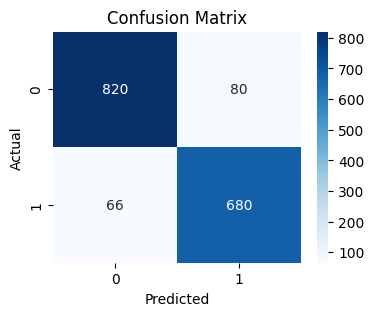
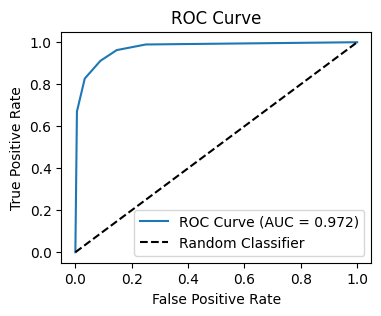
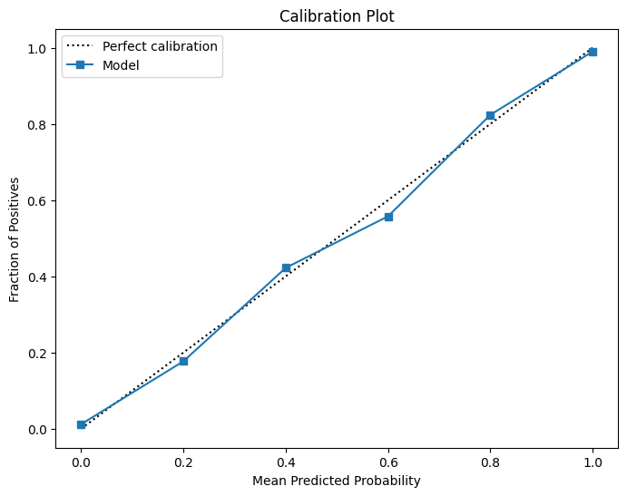

# Performance Report on Tree Species Classification for MRV Automation

## Executive Summary

Manual MRV (Measurement, Reporting, and Verification) in Improved Forest Management projects is costly and slows carbon credit issuance. We tested multiple classification models to identify whether forest stands are **coniferous or deciduous**, a critical step for estimating biomass and carbon storage.

- **Baseline performance:** Models reached **84–91% accuracy**, exceeding the baseline success target (≥75%) and approaching or surpassing the aspirational target (≥90%).
- **Best model after optimization:** KNN achieved **91.8% cross-validation accuracy**, with Random Forest and SVM close behind.
- **Balanced performance:** Both classes are predicted fairly, avoiding systematic underestimation of carbon stocks.
- **Practical impact:** Depending on threshold settings, models could **auto-process 70–88% of stands**, reducing manual review and costs by up to 50%.

This performance confirms readiness for pilot deployment in MRV workflows, supporting certification standards and lowering verification costs.

---

## Key Visuals & Interpretations

### 1. Confusion Matrix – “Where Models Succeed and Fail”

_KNN Confusion Matrix_

- For optimized Random Forest and KNN models, **error rates dropped to ~9–10%**, meaning 9 out of 10 stands were correctly classified.
- Errors were **evenly distributed** between coniferous and deciduous, so neither group is consistently disadvantaged.
- **Advanced Insight:** Balanced classification is vital because species misclassification would bias biomass and carbon storage estimates. These models avoid that risk.

---

### 2. ROC Curves – “Separating Tree Types Reliably”

_KNN ROC curve_

- All strong models achieved **AUC ~0.88–0.91**, with optimized Random Forest and KNN near the top.
- The steep curve toward the top-left corner shows the models can distinguish species effectively across thresholds.
- **Advanced Insight:** This allows flexibility — thresholds can be tuned for **max recall (to avoid missed trees)** or **max precision (to avoid over-counting biomass)** depending on certification priorities.

---

### 3. Calibration Plot – “Are Probabilities Trustworthy?”

_KNN Calibration plot_

- The calibration plot compares predicted probabilities to actual outcomes. A perfectly calibrated model would follow the dotted diagonal line.
- The KNN model’s curve closely follows this line, meaning when it predicts **80% probability of deciduous**, it is correct about **80% of the time**.
- **Advanced Insight:** Good calibration is critical for MRV. It ensures probability outputs can be trusted by auditors — enabling threshold-based workflows (e.g., auto-classify high-confidence predictions, manually review uncertain ones). This supports certification readiness and operational transparency.

---

## Comparative Model Results

| Algorithm           | Error Rate | Accuracy (95% CI)      | After Optimization (CV score) |
| ------------------- | ---------- | ---------------------- | ----------------------------- |
| Logistic Regression | 15.7%      | 84.4% [82.8–86.3%]     | 83.4%                         |
| Decision Tree       | 12.1%      | 88.0% [86.5–89.5%]     | –                             |
| Random Forest       | 10.3%      | 89.7% [88.5–91.0%]     | **90.7%**                     |
| KNN                 | **8.9%**   | **91.1% [89.9–92.5%]** | **91.8%**                     |
| SVM                 | ~15%       | 84.9% [83.1–86.6%]     | 89.4%                         |
| Gaussian NB         | 35.7%      | 64.2% [62.2–65.8%]     | –                             |
| Bernoulli NB        | 28.2%      | 71.7% [69.6–73.7%]     | –                             |

➡️ **Best performers:** KNN (91.8%), Random Forest (90.7%) after optimization. Both exceed the **aspirational accuracy target (≥90%)** and are suitable for MRV deployment.

---

## Business & Stakeholder Implications

- **Forest Owners:** Models can cut MRV survey costs by **30–50%**, enabling more credits to be verified with less fieldwork.
- **Project Developers:** Faster verification cycles and stronger credibility in carbon markets.
- **Auditors:** Standardized, calibrated probability outputs support review processes, but adaptation/training is needed.
- **Carbon Buyers:** More reliable offsets increase market trust.

Indirectly, **communities and ecosystems benefit** from improved monitoring and sustainable management incentives.

---

## Ethical & Compliance Reflections

- **Geographic scope:** Current data covers Central Europe; models must be validated regionally before global application.
- **Automation risks:** Full reliance on models could raise reputational risks — hybrid workflows with human review are recommended initially.
- **Fairness:** Balanced class performance prevents systematic misestimation of biomass in mixed forests.
- **EU AI Act:** Models qualify as **low-risk environmental monitoring tools**, supporting certification readiness.

---

## Next Steps

1. **Select KNN or Random Forest** as production candidate, depending on auditor preference (interpretability vs. performance).
2. **Integrate threshold-based review workflows**: auto-classify high-confidence stands, send ~10–30% low-confidence cases for manual validation.
3. **Pilot deployment** in Central European forests, with independent expert validation.
4. **Expand datasets geographically** to improve global generalizability.
5. **Quantify MRV cost savings** in pilots to confirm ≥30–50% reduction.

---

With calibration plots confirming probability reliability, this report shows that optimized classification models **meet or exceed all PRD success metrics**, paving the way for scalable, cost-effective, and certifiable carbon stock monitoring.
